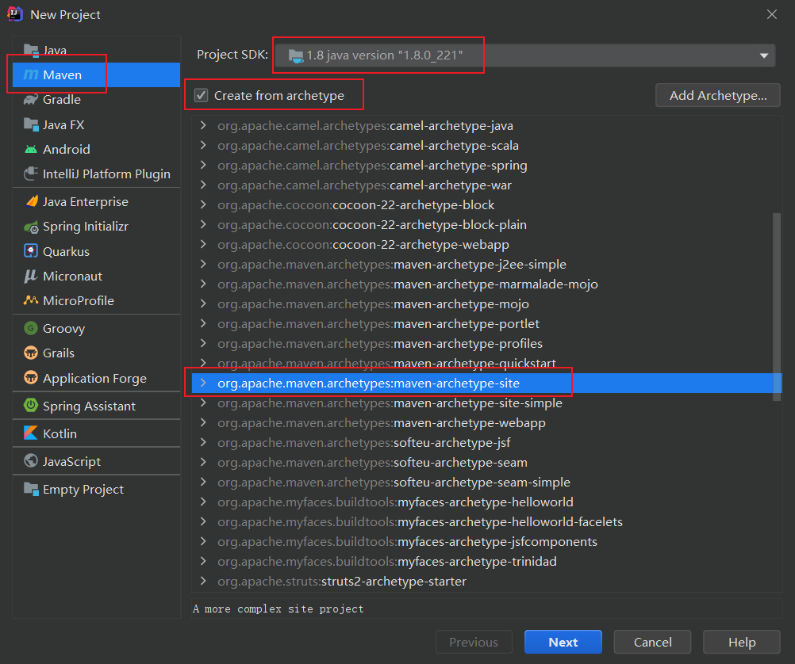
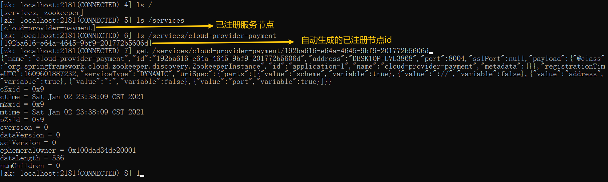

# spring-cloud-2020-study

> 如果使用 github 克隆仓库缓慢，可以移步到笔者在 gitee 平台实时同步的仓库：https://gitee.com/woodwhales/spring-cloud-2020-study

# 概述

## 课程相关资料

Spring Cloud 第二季：

> 对应视频：[尚硅谷2020最新版SpringCloud(H版&alibaba)框架开发教程全套完整版从入门到精通(大牛讲授spring cloud)](https://www.bilibili.com/video/BV18E411x7eT?p=4)
>
> 周阳老师也在自己的 GitHub 仓库上发布了当堂源码：https://github.com/zzyybs/atguigu_spirngcloud2020
>
> 笔者也 fork 了一份该源码：https://github.com/woodwhales/atguigu_spirngcloud2020
>
> 对应资料：[尚硅谷SpringCloud第2季](doc/尚硅谷SpringCloud第2季)，建议使用[百度脑图](https://naotu.baidu.com)打开（只能看文字，不能看图片）。
>
> 网友整理的学习笔记或者资料：
>
> https://github.com/liusCoding/springcloud-2020
>
> https://github.com/leelovejava/cloud2020
>
> https://github.com/OT-mt/cloud2020


所需软件：

apache-jmeter-5.3：https://archive.apache.org/dist/jmeter/binaries/apache-jmeter-5.3.zip

consul_1.7.2_windows_amd64：https://releases.hashicorp.com/consul/1.7.2/consul_1.7.2_windows_amd64.zip

nacos-server-1.1.4：https://github.com/alibaba/nacos/releases/download/1.1.4/nacos-server-1.1.4.zip

seata-server-0.9.0：https://github.com/seata/seata/releases/download/v0.9.0/seata-server-0.9.0.zip

sentinel-dashboard-1.6.3：https://github.com/alibaba/Sentinel/releases/download/1.6.3/sentinel-dashboard-1.6.3.jar

zipkin-server-2.12.9-exec：https://dl.bintray.com/openzipkin/maven/io/zipkin/java/zipkin-server/2.12.9/zipkin-server-2.12.9-exec.jar

zookeeper-3.4.11：https://archive.apache.org/dist/zookeeper/zookeeper-3.4.11/zookeeper-3.4.11.tar.gz

想完全打开思维导图，则需要安装 MindManager：https://www.mindmanager.com/en/support/download-library/

## 课程大纲

课程大纲的思维导图如下：


因为上述思维导图文件太大，不利于快速打开阅读学习，所以笔者在此思维导图基础上结合视频教程，自己整理一套属于自己的学习笔记。

# 一、微服务架构零基础理论入门(小白必看)

## 笔记大纲

技术要求：java8 + maven + git、github + Nginx + RabbotMQ + SpringBoot2.0

Git 源码地址：[https:github.com/spring-projects/spring-boot/releases/](https:github.com/spring-projects/spring-boot/releases/)

Spring Cloud 视频教程第一季大纲：


> 对应视频：[尚硅谷经典SpringCloud框架开发教程全套完整版从入门到精通(大牛讲授spring cloud)](https://www.bilibili.com/video/BV1wW411V7Df)
>
> 对应资料：[尚硅谷SpringCloud第1季](doc/尚硅谷SpringCloud第1季)

## 扩展资料

尚硅谷Java面试题第一季：

> 对应视频：[尚硅谷经典Java面试题第一季(java面试精讲)](https://www.bilibili.com/video/BV1Eb411P7bP)
>
> 对应资料：[尚硅谷Java面试题第1季](doc/尚硅谷Java面试题第1季)

尚硅谷Java面试题第二季：

> 对应视频：[尚硅谷Java大厂面试题第二季(java面试必学，周阳主讲)](https://www.bilibili.com/video/BV18b411M7xz)
>
> 对应资料：[尚硅谷Java面试题第2季](doc/尚硅谷Java面试题第2季)
>
> 网友整理的学习笔记或者资料：
>
> https://github.com/MaJesTySA/JVM-JUC-Core
>
> https://github.com/yangjinwh/Mindmap
>
> https://gitee.com/moxi159753/LearningNotes/tree/master/%E6%A0%A1%E6%8B%9B%E9%9D%A2%E8%AF%95/JUC

尚硅谷Java面试题第三季：

> 对应视频：[尚硅谷2021逆袭版Java面试题第三季（java大厂面试题，周阳主讲）](https://www.bilibili.com/video/BV1Hy4y1B78T)
>
> 对应资料：[尚硅谷Java面试题第3季](doc/尚硅谷Java面试题第3季)

尚硅谷Java数据结构与java算法（Java数据结构与算法）：

> 对应视频：[尚硅谷Java数据结构与java算法（Java数据结构与算法）](https://www.bilibili.com/video/BV1E4411H73v)
>
> 对应资料：[尚硅谷图解Java数据结构和算法](doc/尚硅谷图解Java数据结构和算法)

尚硅谷JUC：

> 对应视频：https://www.bilibili.com/video/BV1c4411w7c7
>
> 对应资料：[尚硅谷JUC](doc/尚硅谷JUC)

juc 与 jvm _并发编程

> 对应视频：https://www.bilibili.com/video/BV1vE411D7KE
>
> 对应资料：[尚硅谷JUC-JVM](doc/尚硅谷JUC-JVM)

# 二、从2.2.x和H版开始说起

## Spring Cloud 与 Spring Boot 版本对应关系

Spring Boot 2.0 wiki：https:github.com/spring-projects/spring-boot/wiki/Spring-Boot-2.0-Release-Notes

Spring Cloud 版本选择需要注意对应 Spring Boot 版本，在 Spring Cloud 官网中 https://spring.io/projects/spring-cloud/#overview 提到：


本视频教程时，2020 年 02 月 15 日 之前，Spring Cloud 最新版本为：Hoxton.SR1，支持的 Spring Boot 版本为：2.2.2.RELEASE。

Spring Cloud 版本可支持的 Spring Boot 版本，在其官网：中已经写明：


Spring 系列版本对应关系，官方参考地址：https://start.spring.io/actuator/info

## 本笔记使用版本

本笔记统一使用如下版本：

	cloud：Hoxton.SR1
	boot：2.2.RELEASE
	cloud：alibaba 2.1.0.RELEASE
	java：Java8
	Maven：3.5及以上
	mysql：5.7及以上


# 三、关于Cloud各种组件的停更/升级/替换


截止 2020 年，Spring Cloud 各种组件的停更/升级/替换：

- 服务注册中心
  Eureka：停更			
  Zookeeper：替代品
  Consul：替代品
  Spring Cloud Alibaba Nacos：替代品（主推）

- 服务调用
  Ribbon：更新变慢，有停更趋势
  Loadbalancer：Spring 新主推产品

- 服务调用
  Feign：停更
  OpenFeign：Spring 新主推产品
- 服务降级
  Hystrix：停更
  resilience4j：替代品，国外使用多
  alibaba Sentinel：替代品，国内使用多
- 服务网关
  Zuul：停更
  Zuul2：推出时间未知，慎用
  gateway：Spring 新主推产品
- 服务配置
  Config：停更
  Spring Cloud Alibaba Nacos：替代品（主推）
  apollo：替代品
- 服务主线
  Bus：停更
  Spring Cloud Alibaba Nacos：替代品（主推）

# 四、微服务架构编码、构建

笔者使用的 IDEA 版本为：2020.2


## 创建父工程

### 创建maven工程




### 设置编码字符集

点击创建好的工程根目录，File -> setttings 设置字符集编码


### 设置 IDEA 支持注解


### 设置JDK编译版本


### IDEA设置无关工程文件不显示

参见笔者的博文：[IDEA 常用设置：忽略显示与工程无关的文件](https://woodwhales.cn/2020/03/03/060/#%E5%BF%BD%E7%95%A5%E6%98%BE%E7%A4%BA%E4%B8%8E%E5%B7%A5%E7%A8%8B%E6%97%A0%E5%85%B3%E7%9A%84%E6%96%87%E4%BB%B6)

## 设置父工程POM

将上述模板工程改造成空的父工程：


设置版本依赖管理：

```xml
<?xml version="1.0" encoding="UTF-8"?>
<project xmlns="http://maven.apache.org/POM/4.0.0" xmlns:xsi="http://www.w3.org/2001/XMLSchema-instance"
         xsi:schemaLocation="http://maven.apache.org/POM/4.0.0 http://maven.apache.org/xsd/maven-4.0.0.xsd">
    <modelVersion>4.0.0</modelVersion>

    <groupId>cn.woodwhales</groupId>
    <artifactId>spring-cloud-demo1</artifactId>
    <version>1.0.0</version>
    <packaging>pom</packaging>

    <name>spring-cloud-demo1</name>
    <url>http://woodwhales.cn/</url>

    <!-- 统一管理jar包版本 -->
    <properties>
        <project.build.sourceEncoding>UTF-8</project.build.sourceEncoding>
        <maven.compiler.source>1.8</maven.compiler.source>
        <maven.compiler.target>1.8</maven.compiler.target>
        <junit.version>4.12</junit.version>
        <log4j.version>1.2.17</log4j.version>
        <lombok.version>1.16.18</lombok.version>
        <mysql.version>8.0.18</mysql.version>
        <druid.version>1.1.16</druid.version>
        <druid.spring.boot.starter.version>1.1.10</druid.spring.boot.starter.version>
        <spring.boot.version>2.2.2.RELEASE</spring.boot.version>
        <spring.cloud.version>Hoxton.SR1</spring.cloud.version>
        <spring.cloud.alibaba.version>2.1.0.RELEASE</spring.cloud.alibaba.version>
        <mybatis.spring.boot.version>1.3.0</mybatis.spring.boot.version>
        <mybatis-spring-boot-starter.version>2.1.1</mybatis-spring-boot-starter.version>
        <hutool-all.version>5.1.0</hutool-all.version>
    </properties>

    <!-- 子模块继承之后，提供作用：锁定版本 + 子module不用谢groupId和version -->
    <dependencyManagement>
        <dependencies>
            <!--spring boot 2.2.2-->
            <dependency>
                <groupId>org.springframework.boot</groupId>
                <artifactId>spring-boot-dependencies</artifactId>
                <version>2.2.2.RELEASE</version>
                <type>pom</type>
                <scope>import</scope>
            </dependency>
            <!--spring cloud Hoxton.SR1-->
            <dependency>
                <groupId>org.springframework.cloud</groupId>
                <artifactId>spring-cloud-dependencies</artifactId>
                <version>Hoxton.SR1</version>
                <type>pom</type>
                <scope>import</scope>
            </dependency>
            <!--Spring cloud alibaba 2.1.0.RELEASE-->
            <dependency>
                <groupId>com.alibaba.cloud</groupId>
                <artifactId>spring-cloud-alibaba-dependencies</artifactId>
                <version>2.1.0.RELEASE</version>
                <type>pom</type>
                <scope>import</scope>
            </dependency>
            <dependency>
                <groupId>mysql</groupId>
                <artifactId>mysql-connector-java</artifactId>
                <version>${mysql.version}</version>
            </dependency>
            <dependency>
                <groupId>com.alibaba</groupId>
                <artifactId>druid</artifactId>
                <version>${druid.version}</version>
            </dependency>
            <dependency>
                <groupId>com.alibaba</groupId>
                <artifactId>druid-spring-boot-starter</artifactId>
                <version>${druid.spring.boot.starter.version}</version>
            </dependency>
            <dependency>
                <groupId>org.mybatis.spring.boot</groupId>
                <artifactId>mybatis-spring-boot-starter</artifactId>
                <version>${mybatis-spring-boot-starter.version}</version>
            </dependency>
            <dependency>
                <groupId>org.projectlombok</groupId>
                <artifactId>lombok</artifactId>
                <version>${lombok.version}</version>
            </dependency>
        </dependencies>
    </dependencyManagement>

    <build>
        <plugins>
            <plugin>
                <groupId>org.springframework.boot</groupId>
                <artifactId>spring-boot-maven-plugin</artifactId>
                <configuration>
                    <fork>true</fork>
                    <addResources>true</addResources>
                </configuration>
            </plugin>
        </plugins>
    </build>

    <!--第三方maven私服-->
    <repositories>
        <repository>
            <id>nexus-aliyun</id>
            <name>Nexus aliyun</name>
            <url>http://maven.aliyun.com/nexus/content/groups/public</url>
            <releases>
                <enabled>true</enabled>
            </releases>
            <snapshots>
                <enabled>true</enabled>
            </snapshots>
        </repository>
    </repositories>

</project>
```

## 搭建父工程

使用 IDEA 创建 project，pom 配置如下：

```xml
<?xml version="1.0" encoding="UTF-8"?>
<project xmlns="http://maven.apache.org/POM/4.0.0" xmlns:xsi="http://www.w3.org/2001/XMLSchema-instance"
         xsi:schemaLocation="http://maven.apache.org/POM/4.0.0 http://maven.apache.org/xsd/maven-4.0.0.xsd">
    <modelVersion>4.0.0</modelVersion>

    <groupId>cn.woodwhales</groupId>
    <artifactId>spring-cloud-project</artifactId>
    <version>1.0.0</version>
    <packaging>pom</packaging>

    <name>spring-cloud-project</name>
    <url>http://woodwhales.cn/</url>

    <!-- 统一管理jar包版本 -->
    <properties>
        <project.build.sourceEncoding>UTF-8</project.build.sourceEncoding>
        <maven.compiler.source>1.8</maven.compiler.source>
        <maven.compiler.target>1.8</maven.compiler.target>
        <junit.version>4.12</junit.version>
        <log4j.version>1.2.17</log4j.version>
        <lombok.version>1.16.18</lombok.version>
        <mysql.version>8.0.18</mysql.version>
        <druid.version>1.1.16</druid.version>
        <druid.spring.boot.starter.version>1.1.10</druid.spring.boot.starter.version>
        <spring.boot.version>2.2.2.RELEASE</spring.boot.version>
        <spring.cloud.version>Hoxton.SR1</spring.cloud.version>
        <spring.cloud.alibaba.version>2.1.0.RELEASE</spring.cloud.alibaba.version>
        <mybatis.spring.boot.version>1.3.0</mybatis.spring.boot.version>
        <mybatis-spring-boot-starter.version>2.1.1</mybatis-spring-boot-starter.version>
        <hutool-all.version>5.1.0</hutool-all.version>
    </properties>

    <!-- 子模块继承之后，提供作用：锁定版本 + 子module不用写groupId和version -->
    <dependencyManagement>
        <dependencies>
            <!--spring boot 2.2.2-->
            <dependency>
                <groupId>org.springframework.boot</groupId>
                <artifactId>spring-boot-dependencies</artifactId>
                <version>2.2.2.RELEASE</version>
                <type>pom</type>
                <scope>import</scope>
            </dependency>
            <!--spring cloud Hoxton.SR1-->
            <dependency>
                <groupId>org.springframework.cloud</groupId>
                <artifactId>spring-cloud-dependencies</artifactId>
                <version>Hoxton.SR1</version>
                <type>pom</type>
                <scope>import</scope>
            </dependency>
            <!--Spring cloud alibaba 2.1.0.RELEASE-->
            <dependency>
                <groupId>com.alibaba.cloud</groupId>
                <artifactId>spring-cloud-alibaba-dependencies</artifactId>
                <version>2.1.0.RELEASE</version>
                <type>pom</type>
                <scope>import</scope>
            </dependency>
            <dependency>
                <groupId>mysql</groupId>
                <artifactId>mysql-connector-java</artifactId>
                <version>${mysql.version}</version>
            </dependency>
            <dependency>
                <groupId>com.alibaba</groupId>
                <artifactId>druid</artifactId>
                <version>${druid.version}</version>
            </dependency>
            <dependency>
                <groupId>com.alibaba</groupId>
                <artifactId>druid-spring-boot-starter</artifactId>
                <version>${druid.spring.boot.starter.version}</version>
            </dependency>
            <dependency>
                <groupId>org.mybatis.spring.boot</groupId>
                <artifactId>mybatis-spring-boot-starter</artifactId>
                <version>${mybatis-spring-boot-starter.version}</version>
            </dependency>
            <dependency>
                <groupId>org.projectlombok</groupId>
                <artifactId>lombok</artifactId>
                <version>${lombok.version}</version>
            </dependency>
        </dependencies>
    </dependencyManagement>

    <build>
        <plugins>
            <plugin>
                <groupId>org.springframework.boot</groupId>
                <artifactId>spring-boot-maven-plugin</artifactId>
                <configuration>
                    <fork>true</fork>
                    <addResources>true</addResources>
                </configuration>
            </plugin>
        </plugins>
    </build>

    <!--第三方maven私服-->
    <repositories>
        <repository>
            <id>nexus-aliyun</id>
            <name>Nexus aliyun</name>
            <url>http://maven.aliyun.com/nexus/content/groups/public</url>
            <releases>
                <enabled>true</enabled>
            </releases>
            <snapshots>
                <enabled>true</enabled>
            </snapshots>
        </repository>
    </repositories>

</project>
```

## 搭建子工程（cloud-api-commons）

选中父工程文件目录，右击选择创建 “Module”，创建 cloud-api-commons 子工程。

```xml
<?xml version="1.0" encoding="UTF-8"?>
<project xmlns="http://maven.apache.org/POM/4.0.0"
         xmlns:xsi="http://www.w3.org/2001/XMLSchema-instance"
         xsi:schemaLocation="http://maven.apache.org/POM/4.0.0 http://maven.apache.org/xsd/maven-4.0.0.xsd">
    <parent>
        <artifactId>spring-cloud-project</artifactId>
        <groupId>cn.woodwhales</groupId>
        <version>1.0.0</version>
    </parent>
    <modelVersion>4.0.0</modelVersion>

    <artifactId>cloud-api-commons</artifactId>

    <dependencies>
        <dependency>
            <groupId>org.springframework.boot</groupId>
            <artifactId>spring-boot-devtools</artifactId>
            <scope>runtime</scope>
            <optional>true</optional>
        </dependency>
        <dependency>
            <groupId>org.projectlombok</groupId>
            <artifactId>lombok</artifactId>
            <optional>true</optional>
        </dependency>
        <dependency>
            <groupId>cn.hutool</groupId>
            <artifactId>hutool-all</artifactId>
            <version>5.1.0</version>
        </dependency>
    </dependencies>
</project>
```

## 搭建子工程（cloud-provider-payment8001）

选中父工程文件目录，右击选择创建 “Module”，创建 cloud-provider-payment8001 子工程。

```xml
<?xml version="1.0" encoding="UTF-8"?>
<project xmlns="http://maven.apache.org/POM/4.0.0"
         xmlns:xsi="http://www.w3.org/2001/XMLSchema-instance"
         xsi:schemaLocation="http://maven.apache.org/POM/4.0.0 http://maven.apache.org/xsd/maven-4.0.0.xsd">
    <parent>
        <artifactId>spring-cloud-project</artifactId>
        <groupId>cn.woodwhales</groupId>
        <version>1.0.0</version>
    </parent>
    <modelVersion>4.0.0</modelVersion>

    <artifactId>cloud-provider-payment8001</artifactId>

    <dependencies>
        <!--引入其他工程-->
        <!-- 引入自己定义的api通用包，可以使用Payment支付Entity -->
        <dependency>
            <groupId>cn.woodwhales</groupId>
            <artifactId>cloud-api-commons</artifactId>
            <version>${project.version}</version>
        </dependency>

        <dependency>
            <groupId>org.springframework.boot</groupId>
            <artifactId>spring-boot-starter-web</artifactId>
        </dependency>
        <dependency>
            <groupId>org.springframework.boot</groupId>
            <artifactId>spring-boot-starter-actuator</artifactId>
        </dependency>
        <dependency>
            <groupId>mysql</groupId>
            <artifactId>mysql-connector-java</artifactId>
        </dependency>
        <dependency>
            <groupId>org.projectlombok</groupId>
            <artifactId>lombok</artifactId>
        </dependency>
        <dependency>
            <groupId>com.alibaba</groupId>
            <artifactId>druid-spring-boot-starter</artifactId>
        </dependency>
        <dependency>
            <groupId>org.mybatis.spring.boot</groupId>
            <artifactId>mybatis-spring-boot-starter</artifactId>
        </dependency>
        <!--jdbc-->
        <dependency>
            <groupId>org.springframework.boot</groupId>
            <artifactId>spring-boot-starter-jdbc</artifactId>
        </dependency>
        <dependency>
            <groupId>org.springframework.boot</groupId>
            <artifactId>spring-boot-devtools</artifactId>
            <scope>runtime</scope>
            <optional>true</optional>
        </dependency>
        <dependency>
            <groupId>org.projectlombok</groupId>
            <artifactId>lombok</artifactId>
            <optional>true</optional>
        </dependency>
        <dependency>
            <groupId>org.springframework.boot</groupId>
            <artifactId>spring-boot-starter-test</artifactId>
            <scope>test</scope>
        </dependency>

    </dependencies>

</project>
```

编写系统配置文件：

```yml
server:
  port: 8001

spring:
  application:
    name: cloud-provider-payment

  datasource:
    type: com.alibaba.druid.pool.DruidDataSource
    driver-class-name: com.mysql.cj.jdbc.Driver
    url: jdbc:mysql://localhost:3306/cloud-2020?useUnicode=true&characterEncoding=utf-8&useSSL=false
    username: root
    password: root1234

mybatis:
  mapper-locations: classpath:mapper/*.xml
  type-aliases-package: cn.woodwhales.springcloud.entity
```

## IDEA 设置热部署

### 步骤1：子工程引用 spring-boot-devtools

各个子工程引用：

```xml
<dependency>
    <groupId>org.springframework.boot</groupId>
    <artifactId>spring-boot-devtools</artifactId>
    <scope>runtime</scope>
    <optional>true</optional>
</dependency>
```

### 步骤2：父工程引用 spring-boot-maven-plugin

父工程引用：

```xml
<plugins>
    <plugin>
        <groupId>org.springframework.boot</groupId>
        <artifactId>spring-boot-maven-plugin</artifactId>
        <configuration>
            <fork>true</fork>
            <addResources>true</addResources>
        </configuration>
    </plugin>
</plugins>
```

### 步骤3：设置 IDEA 及时编译


### 步骤4：IDEA 系统参数设置

按键：ctrl+shift+alt+/，搜索 Registry


## 搭建子工程（cloud-consumer-order80）

```xml
<?xml version="1.0" encoding="UTF-8"?>
<project xmlns="http://maven.apache.org/POM/4.0.0"
         xmlns:xsi="http://www.w3.org/2001/XMLSchema-instance"
         xsi:schemaLocation="http://maven.apache.org/POM/4.0.0 http://maven.apache.org/xsd/maven-4.0.0.xsd">
    <parent>
        <artifactId>spring-cloud-project</artifactId>
        <groupId>cn.woodwhales</groupId>
        <version>1.0.0</version>
    </parent>
    <modelVersion>4.0.0</modelVersion>

    <artifactId>cloud-consumer-order80</artifactId>

    <dependencies>
        <!-- 引入自己定义的api通用包，可以使用Payment支付Entity -->
        <dependency>
            <groupId>cn.woodwhales</groupId>
            <artifactId>cloud-api-commons</artifactId>
            <version>${project.version}</version>
        </dependency>
        <dependency>
            <groupId>org.springframework.boot</groupId>
            <artifactId>spring-boot-starter-web</artifactId>
        </dependency>
        <dependency>
            <groupId>org.springframework.boot</groupId>
            <artifactId>spring-boot-starter-actuator</artifactId>
        </dependency>
        <dependency>
            <groupId>org.springframework.boot</groupId>
            <artifactId>spring-boot-devtools</artifactId>
            <scope>runtime</scope>
            <optional>true</optional>
        </dependency>
        <dependency>
            <groupId>org.projectlombok</groupId>
            <artifactId>lombok</artifactId>
            <optional>true</optional>
        </dependency>
        <dependency>
            <groupId>org.springframework.boot</groupId>
            <artifactId>spring-boot-starter-test</artifactId>
            <scope>test</scope>
        </dependency>
    </dependencies>
</project>
```

## 微服务工程搭建总结

截止 v1.0.0 版本，本系统工程包含：cloud-api-commons、cloud-provider-payment8001、cloud-consumer-order80


# 五、Eureka服务注册与发现

## 搭建 eureka server 工程（cloud-eureka-server7001）

### springboot 1.x 与 2.x 本版对比

1.x 引入 eureka 依赖为：

```xml
<dependency>
    <groupId>org.springframework.cloud</groupId>
    <artifactId>spring-cloud-starter-eureka</artifactId>
</dependency>
```

2.x 引入 eureka 依赖为：

```xml
<dependency>
    <groupId>org.springframework.cloud</groupId>
    <artifactId>spring-cloud-starter-netflix-eureka-server</artifactId>
</dependency>
```

### pom依赖

```
<?xml version="1.0" encoding="UTF-8"?>
<project xmlns="http://maven.apache.org/POM/4.0.0"
         xmlns:xsi="http://www.w3.org/2001/XMLSchema-instance"
         xsi:schemaLocation="http://maven.apache.org/POM/4.0.0 http://maven.apache.org/xsd/maven-4.0.0.xsd">
    <parent>
        <artifactId>spring-cloud-project</artifactId>
        <groupId>cn.woodwhales</groupId>
        <version>2.0.0</version>
    </parent>
    <modelVersion>4.0.0</modelVersion>

    <artifactId>cloud-eureka-server7001</artifactId>

    <dependencies>
        <!--eureka-server-->
        <dependency>
            <groupId>org.springframework.cloud</groupId>
            <artifactId>spring-cloud-starter-netflix-eureka-server</artifactId>
        </dependency>
        <!-- 引入自己定义的api通用包，可以使用Payment支付Entity -->
        <dependency>
            <groupId>cn.woodwhales</groupId>
            <artifactId>cloud-api-commons</artifactId>
            <version>${project.version}</version>
        </dependency>
        <!--boot web actuator-->
        <dependency>
            <groupId>org.springframework.boot</groupId>
            <artifactId>spring-boot-starter-web</artifactId>
        </dependency>
        <dependency>
            <groupId>org.springframework.boot</groupId>
            <artifactId>spring-boot-starter-actuator</artifactId>
        </dependency>
        <!--一般通用配置-->
        <dependency>
            <groupId>org.springframework.boot</groupId>
            <artifactId>spring-boot-devtools</artifactId>
            <scope>runtime</scope>
            <optional>true</optional>
        </dependency>
        <dependency>
            <groupId>org.projectlombok</groupId>
            <artifactId>lombok</artifactId>
        </dependency>
        <dependency>
            <groupId>org.springframework.boot</groupId>
            <artifactId>spring-boot-starter-test</artifactId>
            <scope>test</scope>
        </dependency>
    </dependencies>

</project>
```

### 系统配置

```yml
server:
  port: 7001

eureka:
  instance:
    hostname: localhost #eureka服务端的实例名称
  client:
    #false表示不向注册中心注册自己
    register-with-eureka: false
    #false表示自己端就是注册中心，我的职责就是维护服务实例，并不需要去检索服务
    fetch-registry: false
    service-url:
      defaultZone: http://${eureka.instance.hostname}:${server.port}/eureka/
```

### 启动

给主启动类添加 @EnableEurekaServer 注解，启动成功之后，浏览器访问：http://127.0.0.1:7001/，可以看到一个空的 eureka 服务控制台界面。


## 注册 cloud-provider-payment8001

在 cloud-provider-payment8001 工程中引入：

```xml
<!--eureka-client-->
<dependency>
    <groupId>org.springframework.cloud</groupId>
    <artifactId>spring-cloud-starter-netflix-eureka-client</artifactId>
</dependency>
```

在启动类添加 @EnableEurekaClient 注解

配置 eureka 配置：

```yml
eureka:
  client:
    #表示是否将自己注册进EurekaServer默认为true。
    register-with-eureka: true
    #是否从EurekaServer抓取已有的注册信息，默认为true。
    #单节点无所谓，集群必须设置为true才能配合ribbon使用负载均衡
    fetchRegistry: true
    service-url:
      #单机版
      defaultZone: http://localhost:7001/eureka
```

启动服务，可在 eureka server 控制台看到已经注册的 payment 服务：


## 注册 cloud-consumer-order80

在 cloud-consumer-order80 工程中引入：

```xml
<!--eureka-client-->
<dependency>
    <groupId>org.springframework.cloud</groupId>
    <artifactId>spring-cloud-starter-netflix-eureka-client</artifactId>
</dependency>
```

在启动类添加 @EnableEurekaClient 注解

配置 eureka 配置：

```yml
eureka:
  client:
    #表示是否将自己注册进EurekaServer默认为true。
    register-with-eureka: true
    #是否从EurekaServer抓取已有的注册信息，默认为true。
    #单节点无所谓，集群必须设置为true才能配合ribbon使用负载均衡
    fetchRegistry: true
    service-url:
      #单机版
      defaultZone: http://localhost:7001/eureka
```

启动服务，可在 eureka server 控制台看到已经注册的 order 服务：


## 微服务注册总结

截止 2.0.0 版本，增加了一个 eureka 注册中心，并将 order 和 payment 服务注册到该注册中心：


## 搭建 eureka 服务集群

搭建 eureka 服务集群是为了：提升服务注册中心的高可用性，实现负载均衡和故障同错功能。

按照搭建 cloud-eureka-server7001 工程步骤，搭建 cloud-eureka-server7001 工程。

在单机版本的 eureka 服务注册中心配置中：

```yml
eureka:
  instance:
    hostname: localhost
```

eureka.instance.hostname 在 eureka 集群中不能名称重名，因此需要修改主机的 hosts 配置文件：

```ini
127.0.0.1 eureka7001.cn
127.0.0.1 eureka7002.cn
```

分别修改 7001 和 7002 的系统配置文件：

```yml
server:
  port: 7001

eureka:
  instance:
    hostname: eureka7001.cn #eureka服务端的实例名称
  client:
    #false表示不向注册中心注册自己
    register-with-eureka: false
    #false表示自己端就是注册中心，我的职责就是维护服务实例，并不需要去检索服务
    fetch-registry: false
    service-url:
      defaultZone: http://eureka7002.cn:7002/eureka/
```

```yml
server:
  port: 7002

eureka:
  instance:
    hostname: eureka7002.cn #eureka服务端的实例名称
  client:
    #false表示不向注册中心注册自己
    register-with-eureka: false
    #false表示自己端就是注册中心，我的职责就是维护服务实例，并不需要去检索服务
    fetch-registry: false
    service-url:
      defaultZone: http://eureka7001.cn:7001/eureka/
```

启动 7001 和 7002 服务，访问：http://eureka7001.cn:7001/ 或者 http://eureka7002.cn:7002/，可以看见服务中心控制台界面。

注册 order 和 payment 到集群的 eureka 注册中心，分别修改俩者注册到 eureka 服务注册中心的配置：

```yml
eureka:
    service-url:
      # 集群版
      defaultZone: http://eureka7001.cn:7001/eureka,http://eureka7002.cn:7002/eureka
```

## 注册 payment 和 order 服务到集群 eureka server

在 payment 和 order 工程配置中，将 配置修改为如下：

```yml
 eureka:
  client:
  	service-url:
      # 单机配置
      # defaultZone: http://eureka7001.cn:7001/eureka/、
      # 集群配置
      defaultZone: http://eureka7001.cn:7001/eureka/,http://eureka7002.cn:7002/eureka/
```

启动 eureka 服务，启动 order 和 payment 服务，访问任一 eureka server 集群节点（http://eureka7001.cn:7001/ 或者 http://eureka7002.cn:7002/），均可见俩个服务已成功注册到集群上：


## 搭建子工程（cloud-provider-payment8002）

按照 cloud-provider-payment8001 工程搭建步骤，搭建相同服务，以实现服务提供者为集群服务。

值得注意的是，服务消费者 order 服务中调用 payment 的服务 http 请求地址需要修改为：

```
http://CLOUD-PROVIDER-PAYMENT
```

并在注册 RestTemplate 实例 bean 的时候添加 @LoadBalanced 注解，否则无法享受调用服务负载均衡。

> @LoadBalanced 为 RestTemplate 提供了负载均衡能力。

## 设置 actuator

健康信息配置的必要性：


当工程中引入了 actuator starter 之后，可以增加一些配置使得 eureka 更易运维。 

```xml
<dependency>
    <groupId>org.springframework.boot</groupId>
    <artifactId>spring-boot-starter-actuator</artifactId>
</dependency>
```

在系统配置文件中配置 eureka 实例 id：

```yml
eureka:
  instance:
    instance-id: payment8002
```

达到的效果为：


设置 eureka 的访问路径显示 ip：

```yml
eureka:
  instance:
    prefer-ip-address: true
```

## 设置服务发现Discovery

使用 @EnableDiscoveryClient 注解，开启 eureka 服务注册发现功能。

在业务代码中引入 DiscoveryClient 实例即可获取 eureka 注册中心中已经成功注册的所有服务信息，demo 用法参见：cn.woodwhales.springcloud.controller.OrderController#discovery

```java
    @Autowired
    private DiscoveryClient discoveryClient;

    public Object discovery() {
        // 获取所有serviceId
        List<String> serviceIds = discoveryClient.getServices();
        Map<String, Map<String, Object>> eurekaMap = new HashMap<>(serviceIds.size());
        for (String serviceId : serviceIds) {
            Map<String, Object> instanceInfoMap = new HashMap<>(5);
            // 通过serviceId获取相应的服务详情信息
            List<ServiceInstance> instances = discoveryClient.getInstances(serviceId);
            for (ServiceInstance instance : instances) {
                instanceInfoMap.put("serviceId", instance.getServiceId());
                instanceInfoMap.put("instanceId", instance.getInstanceId());
                instanceInfoMap.put("host", instance.getHost());
                instanceInfoMap.put("port", instance.getPort());
                instanceInfoMap.put("uri", instance.getUri());
            }
            eurekaMap.put(serviceId, instanceInfoMap);
        }
        return eurekaMap;
    }
```

## 自我保护机制

eureka 属于了 CAP 理论中的 AP。

在某个时刻某个服务发生故障了，eureka 注册中心不会立即将该服务清理下线，而是依旧会对该服务节点信息进行保存。

## 关闭自我保护机制

eureka server 端

```yml
eureka:
  server:
    # 关闭自我保护机制
    enable-self-preservation: false
    eviction-interval-timer-in-ms: 2000
```

eureka client 端

```yml
eureka:
  instance:
    #Eureka客户端向服务端发送心跳的时间间隔，单位为秒(默认是30秒)
    lease-renewal-interval-in-seconds: 1
    #Eureka服务端在收到最后一次心跳后等待时间上限，单位为秒(默认是90秒)，超时将剔除服务
    lease-expiration-duration-in-seconds: 2
```

# 六、Zookeeper服务注册与发现

> 工程示例：cloud-provider-payment8004

搭建 cloud-provider-payment8004 工程，使用 zk 进行服务注册。搭建 zk 服务参见：[zookeeper window环境安装、集成为windows服务、单机伪集群搭建](https://woodwhales.cn/2020/04/06/065/)

## 配置pom

核心的依赖为：spring-cloud-starter-zookeeper-discovery，需要注意的是该启动器自身已经包含了一个 zk jar包，如果和要链接的 zk 服务器版本不一致，需要排除掉这个自身带的 zk，依赖和 zk 服务器版本一致的 zk jar 包。 

```xml
<!-- SpringBoot整合zookeeper客户端 -->
<dependency>
    <groupId>org.springframework.cloud</groupId>
    <artifactId>spring-cloud-starter-zookeeper-discovery</artifactId>
    <!--先排除自带的zookeeper3.5.3-->
    <exclusions>
        <exclusion>
            <groupId>org.apache.zookeeper</groupId>
            <artifactId>zookeeper</artifactId>
        </exclusion>
    </exclusions>
</dependency>
<!--添加zookeeper3.4.11版本-->
<dependency>
    <groupId>org.apache.zookeeper</groupId>
    <artifactId>zookeeper</artifactId>
    <version>3.4.11</version>
</dependency>
```

## 配置yml

设置 zk 链接源

```yml
server:
  address: 0.0.0.0
  port: 8004

# 服务别名 --- 注册zookeeper到注册中心名称
spring:
  application:
    name: cloud-provider-payment
  cloud:
    zookeeper:
      connect-string: 127.0.0.1:2181
```

## 主启动类

> 工程示例：cloud-provider-payment8004

在主启动类上添加：@EnableDiscoveryClient 注解

```java
import org.springframework.boot.SpringApplication;
import org.springframework.boot.autoconfigure.SpringBootApplication;
import org.springframework.cloud.client.discovery.EnableDiscoveryClient;

/**
 * @author woodwhales
 * @date 2021-01-02 24:03
 */
@EnableDiscoveryClient // 该注解用于向使用consul或者zookeeper作为注册中心时注册服务
@SpringBootApplication
public class OrderMain8004 {

    public static void main(String[] args) {
        SpringApplication.run(OrderMain8004.class, args);
    }

}
```

先启动 zk 服务器，再启动 cloud-provider-payment8004 服务，可以在 zk 中看到已经成功注册的节点信息：



注意：zk 是 CAP 中的 CP，当某个节点在一定时间内无心跳回应，zk 服务器会将该节点删除。当这个节点重新恢复回来，则 zk 服务器会生成新的节点 id。因此 zk 中存储的服务信息为**临时节点**。

# 七、Consul服务注册与发现

## 安装运行consul

在 consul 官网（https://www.consul.io/downloads）下载 consul，并解压压缩包得到 consul.exe 文件，使用 cmd 命令查看 consul 版本：

```cmd
consul -v
```

官方文档地址：https://www.consul.io/docs/intro，官网建议配置到 PATH 系统环境变量里，方便使用。

启动 consul 执行命令，默认启动 8500 http 端口。

```cmd
consul agent -dev
```

 更多参数含义，参见：https://www.consul.io/docs/agent/options

## 搭建 cloud-consumer-consul-order80 工程

在工程中引入：

```xml
        <dependency>
            <groupId>org.springframework.cloud</groupId>
            <artifactId>spring-cloud-starter-consul-discovery</artifactId>
        </dependency>
```

在系统配置文件中，配置服务注册链接地址为：127.0.0.1:8500 即可。

```yml
spring:
  application:
    name: cloud-consumer-consul-order
  cloud:
    zookeeper:
      connect-string: 127.0.0.1:8500
```

启动工程之后，浏览器访问：http://127.0.0.1:8500/ 即可看到已成功注册的服务节点信息：


## Eureka、Zookeeper、Consul 对比


# 八、Ribbon负载均衡调用

Ribbon 是一个软负载均衡的客户端软件。

spring-cloud-starter-netflix-eureka-client 自身包含了 Ribbon 依赖，因此只需要引入 spring-cloud-starter-netflix-eureka-client 就已经集成了 Ribbon：

```xml
<dependency>
    <groupId>org.springframework.cloud</groupId>
    <artifactId>spring-cloud-starter-netflix-eureka-client</artifactId>
</dependency>
```

使用 IDEA 的 maven helper 插件查看依赖关系也可以看出：


## RestTemplate的Object与Entity的区别

```java
@Override
@Nullable
public <T> T getForObject(URI url, Class<T> responseType) throws RestClientException {
    RequestCallback requestCallback = acceptHeaderRequestCallback(responseType);
    HttpMessageConverterExtractor<T> responseExtractor =
        new HttpMessageConverterExtractor<>(responseType, getMessageConverters(), logger);
    return execute(url, HttpMethod.GET, requestCallback, responseExtractor);
}

@Override
public <T> ResponseEntity<T> getForEntity(String url, Class<T> responseType, Object... uriVariables)
    throws RestClientException {

    RequestCallback requestCallback = acceptHeaderRequestCallback(responseType);
    ResponseExtractor<ResponseEntity<T>> responseExtractor = responseEntityExtractor(responseType);
    return nonNull(execute(url, HttpMethod.GET, requestCallback, responseExtractor, uriVariables));
}
```


getForObject() 方法返回的是响应体中对象

getForEntity() 方法返回的是 ResponseEntity 对象，ResponseEntity 对象包含了请求响应的更新详细信息（状态码、响应体、响应头等）。

## Ribbon 负载均衡策略

Ribbon 负载均衡策略的核心接口为：com.netflix.loadbalancer.IRule：

```java

/**
 * Interface that defines a "Rule" for a LoadBalancer. A Rule can be thought of
 * as a Strategy for loadbalacing. Well known loadbalancing strategies include
 * Round Robin, Response Time based etc.
 * 
 * @author stonse
 * 
 */
public interface IRule{
    /*
     * choose one alive server from lb.allServers or
     * lb.upServers according to key
     * 
     * @return choosen Server object. NULL is returned if none
     *  server is available 
     */

    public Server choose(Object key);
    
    public void setLoadBalancer(ILoadBalancer lb);
    
    public ILoadBalancer getLoadBalancer();    
}
```

该接口有 7 种实现：


分别为：

| 策略类                    | 命名               | 描述                                                         |
| ------------------------- | ------------------ | ------------------------------------------------------------ |
| RandomRule                | 随机策略           | 随机选择server                                               |
| RoundRobinRule            | 轮询策略           | 按照顺序选择server（ribbon默认策略）                         |
| RetryRule                 | 重试策略           | 在一个配置时间段内，当选择server不成功，则一直尝试选择一个可用的server |
| BestAvailableRule         | 最低并发策略       | 逐个考察server，如果server断路器打开，则忽略，再选择其中并发链接最低的server |
| AvailabilityFilteringRule | 可用过滤策略       | 过滤掉一直失败并被标记为circuit tripped的server，过滤掉那些高并发链接的server（active connections超过配置的阈值） |
| ResponseTimeWeightedRule  | 响应时间加权重策略 | 根据server的响应时间分配权重，响应时间越长，权重越低，被选择到的概率也就越低。响应时间越短，权重越高，被选中的概率越高，这个策略很贴切，综合了各种因素，比如：网络，磁盘，io等，都直接影响响应时间 |
| ZoneAvoidanceRule         | 区域权重策略       | 综合判断server所在区域的性能，和server的可用性，轮询选择server并且判断一个AWS Zone的运行性能是否可用，剔除不可用的Zone中的所有server |

## 自定义负轮询载均衡策略

步骤1：定义自定义负载均衡接口

```java
import java.util.List;

/**
 * @author woodwhales
 * @date 2021-01-13 23:03
 */
@Component
public interface MyLoadBalancer {

    /**
     * 从可用节点列表中获取要执行的节点
     * @param serviceInstances
     * @return
     */
    ServiceInstance getInstance(List<ServiceInstance> serviceInstances);

}
```

步骤2：模仿 com.netflix.loadbalancer.RoundRobinRule 策略编写自定义 ribbon 策略

自定义 ribbon 策略的核心在于，使用自旋锁统计请求的次数。使用请求的第几次取模可用节点数得到可用节点的索引。

```java
import lombok.extern.slf4j.Slf4j;
import org.springframework.cloud.client.ServiceInstance;
import org.springframework.stereotype.Component;

import java.util.List;
import java.util.concurrent.atomic.AtomicInteger;

/**
 * @author woodwhales
 * @date 2021-01-13 23:22
 */
@Slf4j
@Component
public class MyLoadBalancerImpl implements MyLoadBalancer {
   
    private AtomicInteger atomicInteger = new AtomicInteger(0);

    /**
     * 统计请求次数，采用自旋锁方式获取请求次数
     * @return
     */
    private final int compareAndGet() {
        int current;
        int next;
        do {
            current = atomicInteger.get();
            next = current >= Integer.MAX_VALUE ? 0 : current + 1;
        } while (!atomicInteger.compareAndSet(current, next));

        log.info("*********** next => {} ***********", next);
        return next;
    }
    
    @Override
    public ServiceInstance getInstance(List<ServiceInstance> serviceInstances) {
        // 请求的第几次 % 可用节点总数 = 当前要执行的节点
        int index = compareAndGet() % serviceInstances.size();
        return serviceInstances.get(index);
    }
}
```

步骤3：使用自定义策略

注意在注册 RestTemplate 为 bean 的配置类中，将 @LoadBalanced 注解去除。

```java
import cn.woodwhales.springcloud.entity.CommonResult;
import cn.woodwhales.springcloud.entity.Payment;
import cn.woodwhales.springcloud.ribbon.MyLoadBalancer;
import lombok.extern.slf4j.Slf4j;
import org.springframework.beans.factory.annotation.Autowired;
import org.springframework.cloud.client.ServiceInstance;
import org.springframework.cloud.client.discovery.DiscoveryClient;
import org.springframework.stereotype.Controller;
import org.springframework.web.bind.annotation.GetMapping;
import org.springframework.web.bind.annotation.PathVariable;
import org.springframework.web.bind.annotation.RequestMapping;
import org.springframework.web.bind.annotation.RestController;
import org.springframework.web.client.RestTemplate;

import java.net.URI;
import java.util.List;

import static java.util.Objects.isNull;

/**
 * @author woodwhales
 * @date 2020-12-19 22:25
 */
@Slf4j
@Controller
@RequestMapping("/consumer")
@RestController
public class OrderController {

    @Autowired
    private RestTemplate restTemplate;

    @Autowired
    private MyLoadBalancer myLoadBalancer;

    @Autowired
    private DiscoveryClient discoveryClient;

    @GetMapping("/payment/get/{id}")
    public CommonResult<Payment> getPayment(@PathVariable("id") Long id) {
        List<ServiceInstance> instances = discoveryClient.getInstances("CLOUD-PROVIDER-PAYMENT");

        if(isNull(instances) || instances.isEmpty()) {
            return null;
        }

        ServiceInstance serviceInstance = myLoadBalancer.getInstance(instances);
        URI uri = serviceInstance.getUri();
        return restTemplate.getForObject(uri + "/payment/get/" + id, CommonResult.class);
    }

}
```


# 九、OpenFeign服务接口调用

# 十、Hystrix断路器

# 十一、Zuul路由网关

# 十二、Gateway新一代网关

# 十三、SpringCloud Config（分布式配置中心）

# 十四、SpringCloud Bus消息总线

# 十五、SpringCloud Stream消息驱动

# 十六、SpringCloud Sleuth分布式链路跟踪

# 十七、SpringCloud Alibaba入门简介

# 十八、SpringCloud Alibaba Nacos服务注册和配置中心

# 十九、SpringCloud Alibaba Sentinel实现熔断与限流

# 二十、SpringCloud Alibaba Seata处理分布式事务

# 二十一、大厂面试第三季(预告片)

